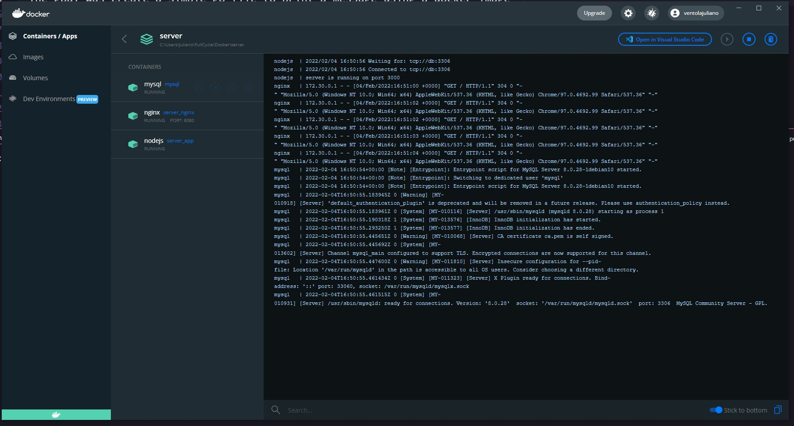

# Server Docker Compose Challenge - FullCycle

  

- The goal was create a server using nginx as reverse proxy to request a page from node listing all users' names of mysql
- The page should return "<\h1>Full Cycle Rocks!<\h1>" and the users' names below the title
- Server will run in http://localhost:8080

# Docker Image

- It was used a dockerfile to create the image for node inside node's folder
- It was used a dockerfile to create the image for nginx inside nginx's folder

# How to use

- _Requirements_: Since i did not upload node_module's folder, you will need a nodejs installation in your machine
- Clone the repository
- run in cmd:

  ```cmd
  cd node
  cd npm i
  cd ..
  docker compose up -d
  ```
